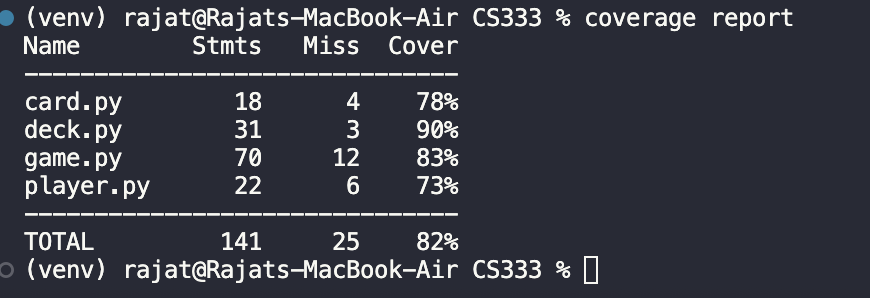

# CS333 Final Project

## Rajat Sharma, Testing and DevOps, Spring 2025

__1) Unit Test Coverage:__

__2) Total Integration Tests: 7__

__3) Automated Testing: Tests are automatically run in an environment other than the development environment and a failing test ends the workflow.__

__4) Necessary artifacts are automatically deployed to the appropriate computing device.__

__5) Changes are triggered by "pushing" to source control.__
